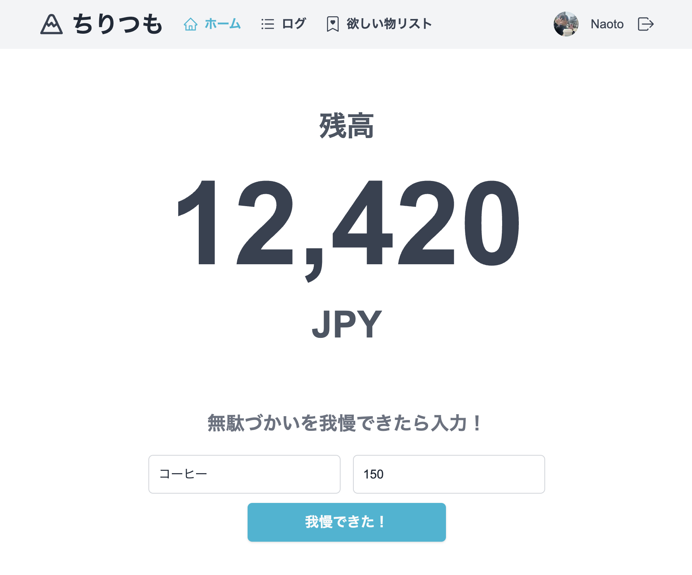
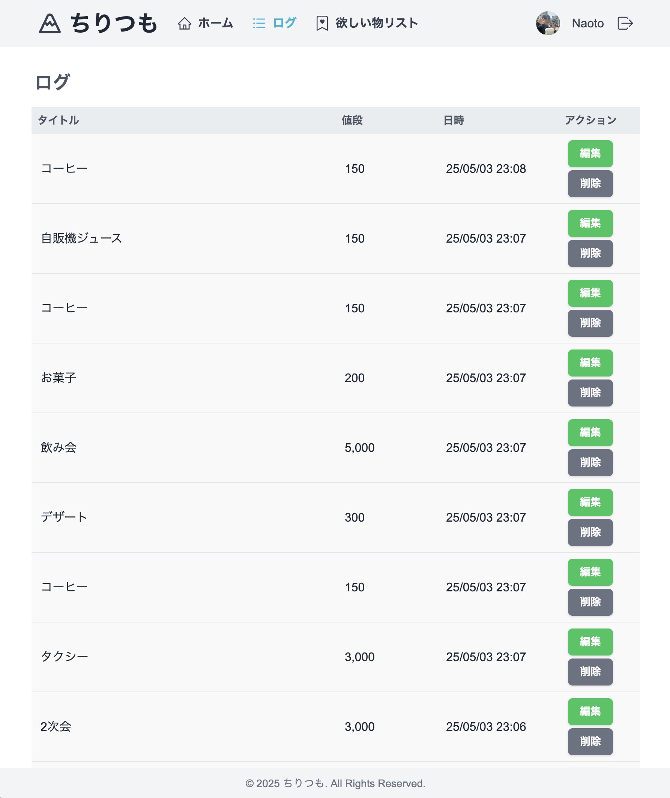
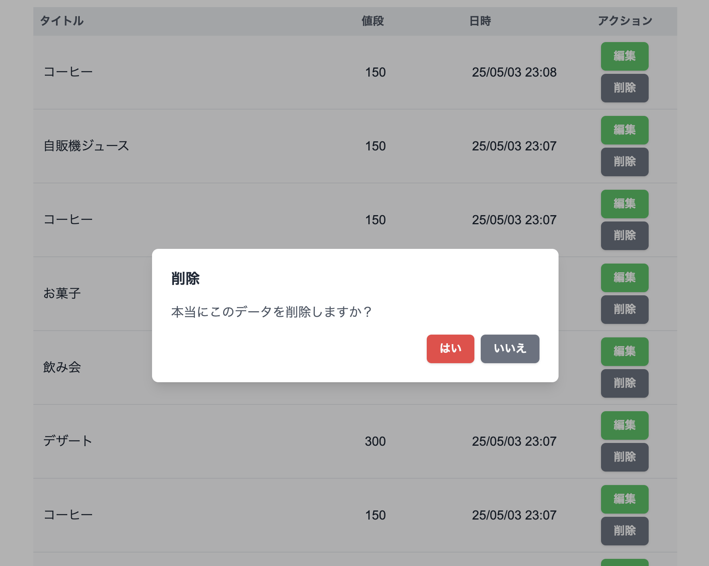
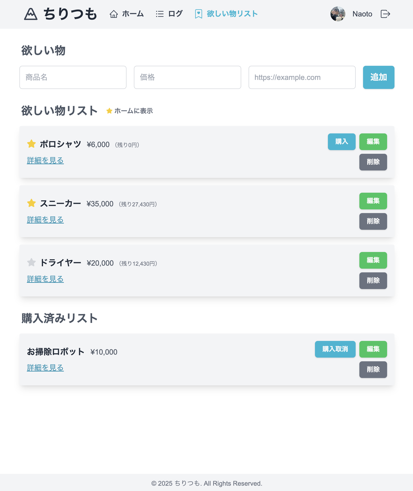
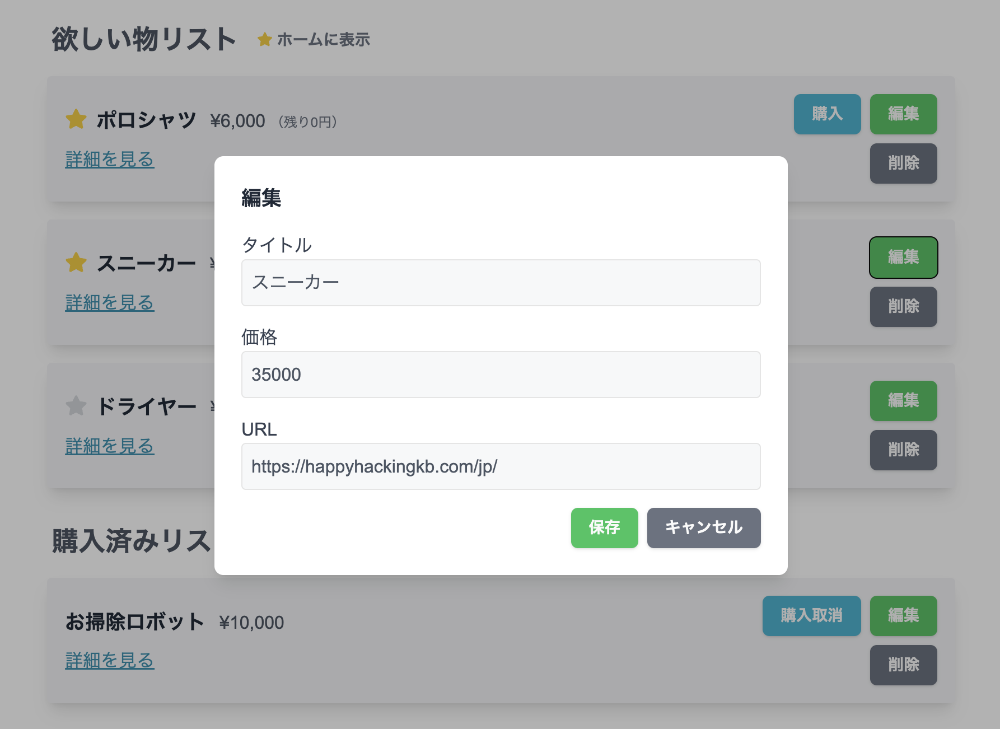
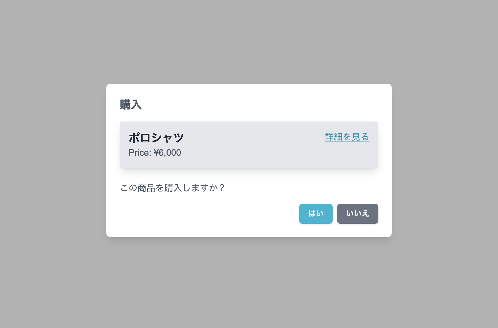

## 概要

アプリ名：ちりつも 
コンセプト：「無駄づかいを我慢したらこのアプリに記録し、貯まったお金で自分の欲しいものを買おう！」 

## 最終成果物

サービスURL：https://chiritsumo-14.vercel.app 

＜体験用ログインアカウント＞ 
メール：[cnann.0615.test@gmail.com](mailto:cnann.0615.test@gmail.com) 
パスワード：testes0615 

＜サービスイメージ＞ 

## 作成したきっかけ

日々の出費を家計簿アプリで管理している中で、「毎朝のコンビニコーヒー」や「ランチ後についつい買ってしまうデザート」など、よく考えると不要なもの（我慢できるもの）に習慣的にお金を使ってしまっていることに気づきました。 
同じように、何気なく無駄遣いをしてしまう人は他にもいるのではないかと考えたのが、このアプリを作ろうと思ったきっかけです。 
また、ただ単に、"無駄遣いをしないように意識する" というのは難しいと感じたため、"欲しいものを手に入れるために、無駄遣いを我慢する"というコンセプトにしました。 
このように目標があれば、日々の節約が自分の幸せにつながるため、頑張る動機になるのではと考えています。

## 開発環境と使用技術

### 開発環境

OS：macOS 
IDE：Visual Studio Code

### 使用技術

フレームワーク：Next.js v.14 AppRouter (React v.18) 
言語：TypeScript 
スタイル：Tailwind CSS, React Icons 
認証：Next.Auth 
ORM：Prisma 
DB：PostgreSQL(Supabase) 
パッケージ管理：npm 
ソースコード管理：GitHub 
テスト：Vitest, React Testing Library, Playwright 
その他：zod, canvas-confetti, use-action-state-compat 

## 機能説明

### 残高管理（貯金）機能

- 我慢した額を管理する機能です。
- 無駄づかいへの欲望が発生した際に、我慢できたらその額を記録（貯金）していきます。
  - 例）出社前に買ってるコーヒーを我慢した！　→　＋150円
  - 例）飲み会（5000円）を断って家で自炊を（500円）した！　→ ＋4500円

 
「我慢できた！」を押下 

### ログ機能

- これまで無駄づかいを我慢したログを閲覧、編集、削除できます。 
   
   
   

### 欲しい物リスト機能

- 欲しいものリストにアイテムを追加できます。 
   
- 欲しいものリストのアイテムを編集、削除できます。 
   
   

### 残高管理機能と欲しい物リスト機能の連携

- 欲しいものリスト進捗

  - 欲しいものリストに登録した商品に対しての残高の割合をグラフで視覚化することで、進捗状況を一目で確認できます。
  - 進捗が100%を上回ると「購入」ボタンが現れます。 

   

- 欲しいものを購入したら、残高が減ります。 
   
  「はい」を押下 
  
